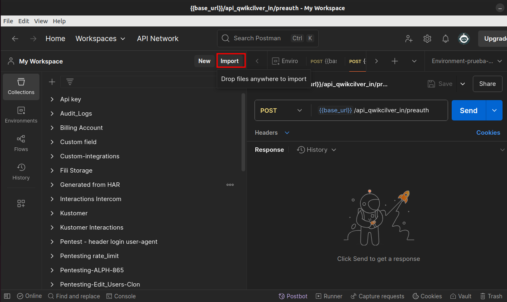
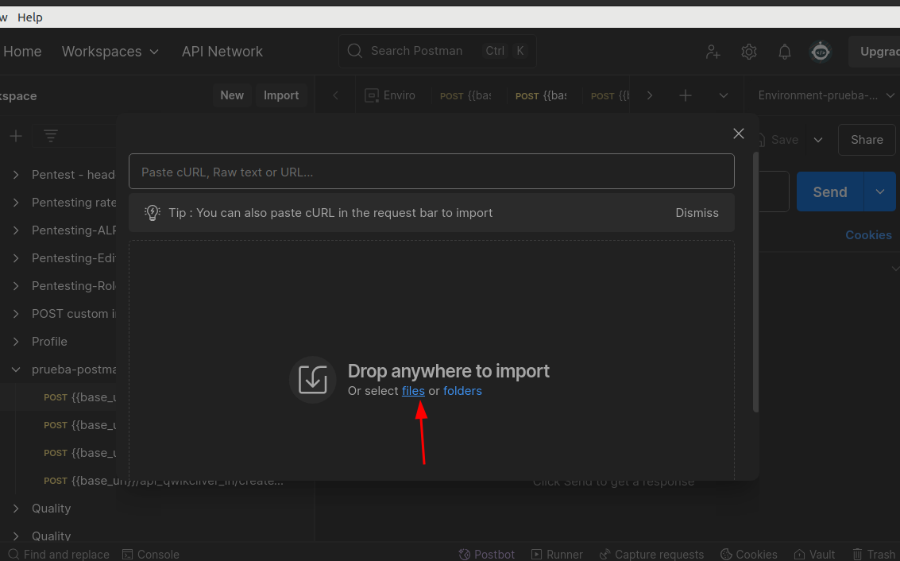
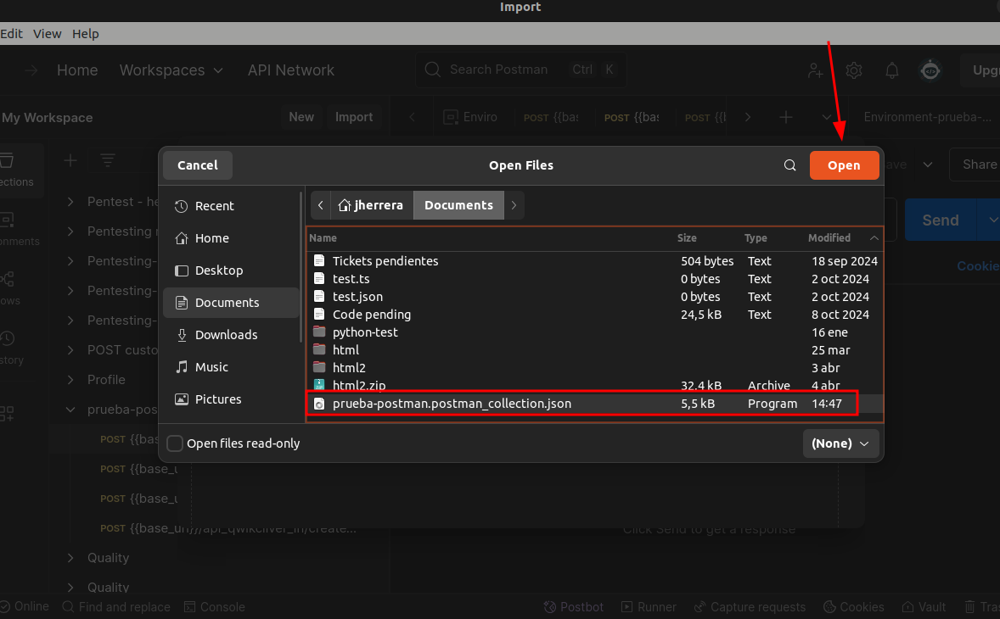
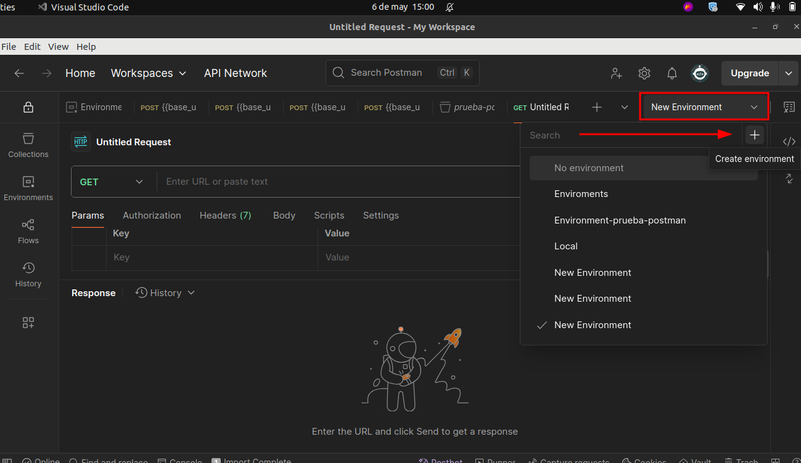
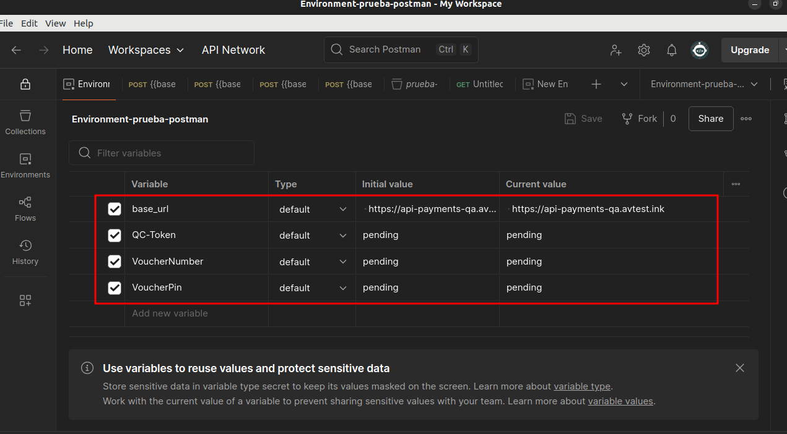
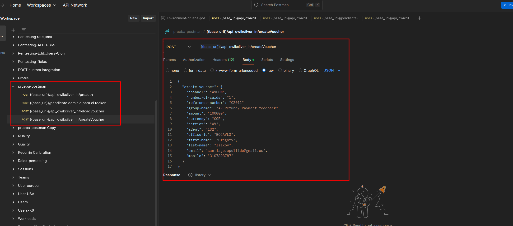
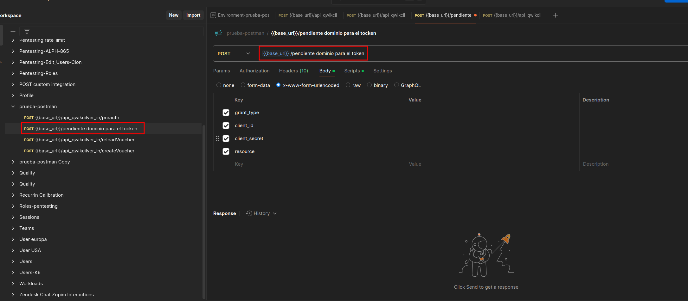
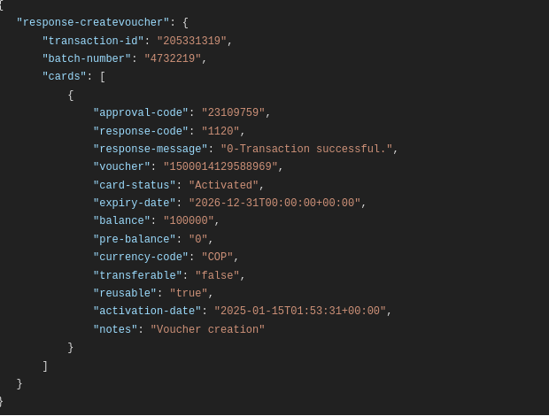
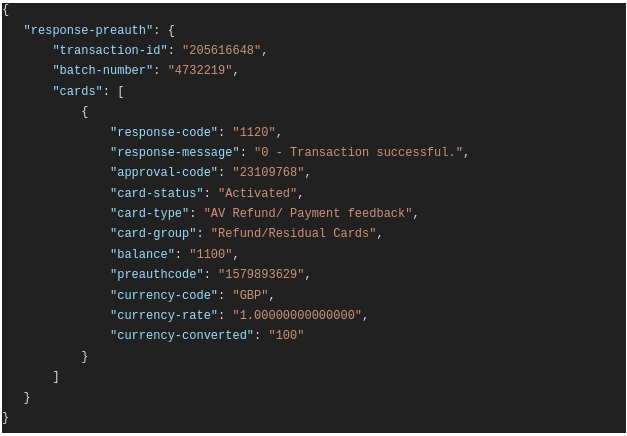
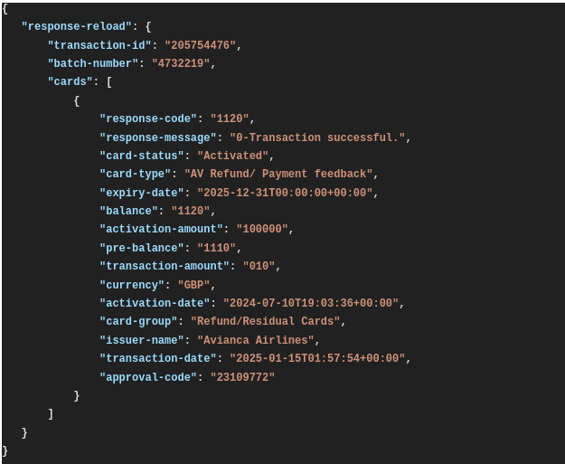

# Cómo importar una colección en Postman, configurar variables de entorno y ejecutar la colección

Este documento explica paso a paso cómo importar una colección en Postman, configurar variables de entorno necesarias y ejecucion de peticiones HTTP

## Requisitos previos
- Tener Postman instalado en tu computador.
- Disponer de un archivo de colección en formato `.json` (la colección que estoy proporcionando en este proyecto).

## Pasos para importar la colección

### 1. Abrir Postman

Inicia la aplicación de Postman en tu equipo.

### 2. Ir a la opción de importación

Haz clic en el botón **"Import"** ubicado en la esquina superior izquierda de la pantalla principal de Postman.

### 3. Seleccionar el archivo de colección

En la ventana emergente:

- Haz clic en **"Upload Files"**.
- Busca y selecciona el archivo `.json` correspondiente a la colección brindada en la raiz de la carpeta con el nombre de prueba-postman.postman_collection.json.
- Luego haz clic en **"Open"**.

### 4. Confirmar la importación

Una vez cargado el archivo, Postman mostrará una vista previa. Verifica que todo esté correcto y haz clic en el botón **"Import"**.

### 5. Configurar las variables de entorno

Se debe crear un Environment para configurar las variables, para este caso desde environments en la parte derecha superior de la pantalla, dar clieck en el la opcion desplegable y luego en el signo mas.

Escribir un nombre de su eleccion para identificar el environment.

Variables para configurar, el tipo se deja por default:

| Clave           | Valor                                             |
|-----------------|---------------------------------------------------|
| `base_url`      | https://api-payments-qa.avtest.ink                |
| `QC-Token`      | pendiente                                         |
| `VoucherNumber` | pendiente                                         |
| `VoucherPin`    | pendiente                                         |

### 6. Ejecucion 

La colección esta configurada para que tome esas variables de entorno, dentro de la misma se encuentran cuatro peticiones POST que se pueden probar llenando los campos pendientes en las variables de entorno, los cuales deben de ser proporcionados.

Para la peticion del token, esta pendiente el dominio por ser proporsionado para su valiodacion

### 7. Validacion de respuestas

En la siguiente imagen podemos ver la respuesta que nos debe de dar la peticion de crear voucher

En la siguiente imagen podemos ver la respuesta que nos debe de dar la peticion de Withdraw balance

En la siguiente imagen podemos ver la respuesta que nos debe de dar la peticion de reload vouncher

### Nota

En esta misma carpeta se encuentra la documentacion de las API en el archivo "prueba-postman-dcumentacion.yml".

Tambien se encuentra el script de Python que valida las respuestas en el archivo "validate-response-python.py"

